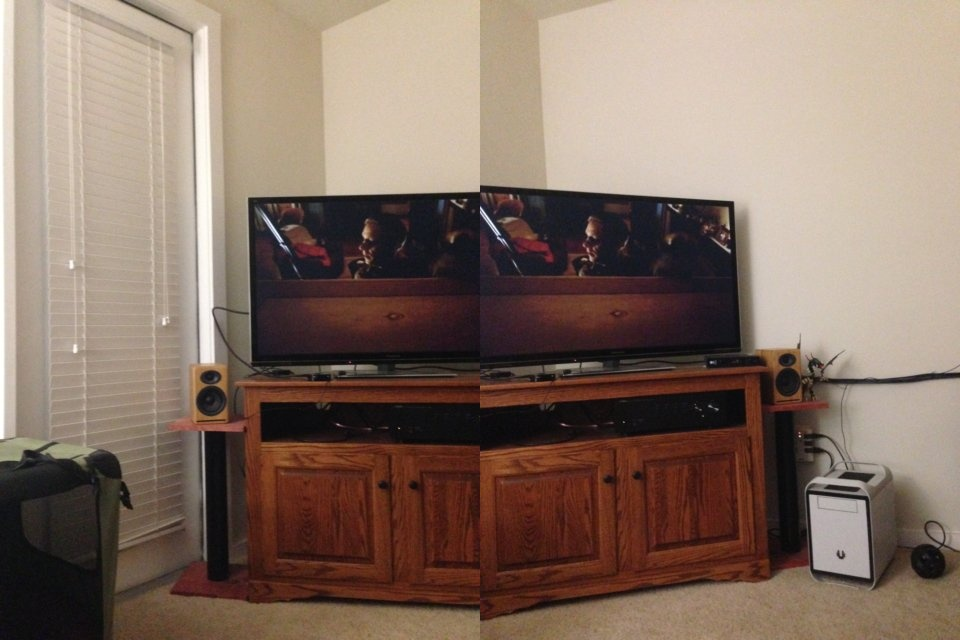
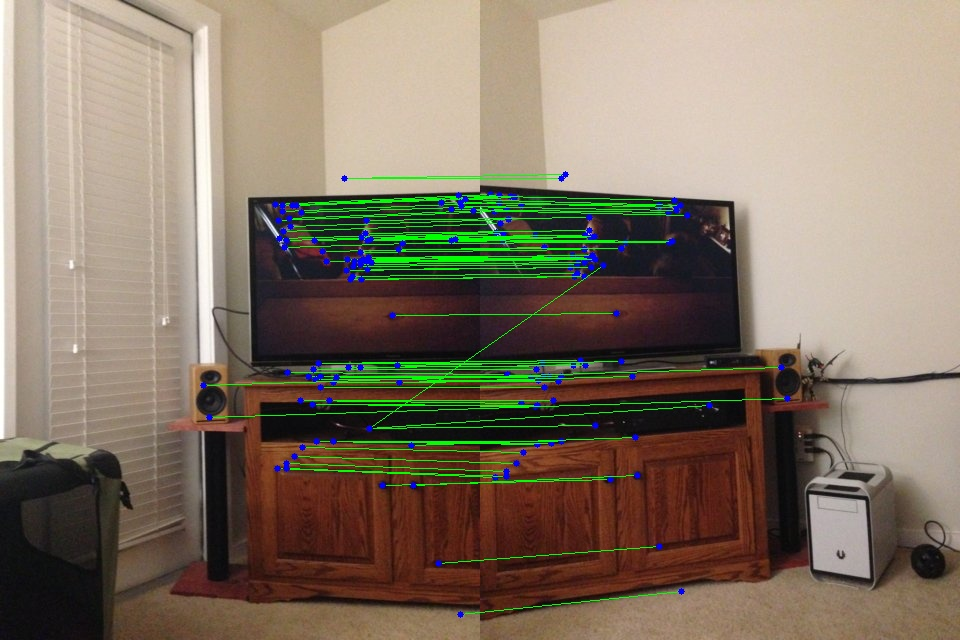
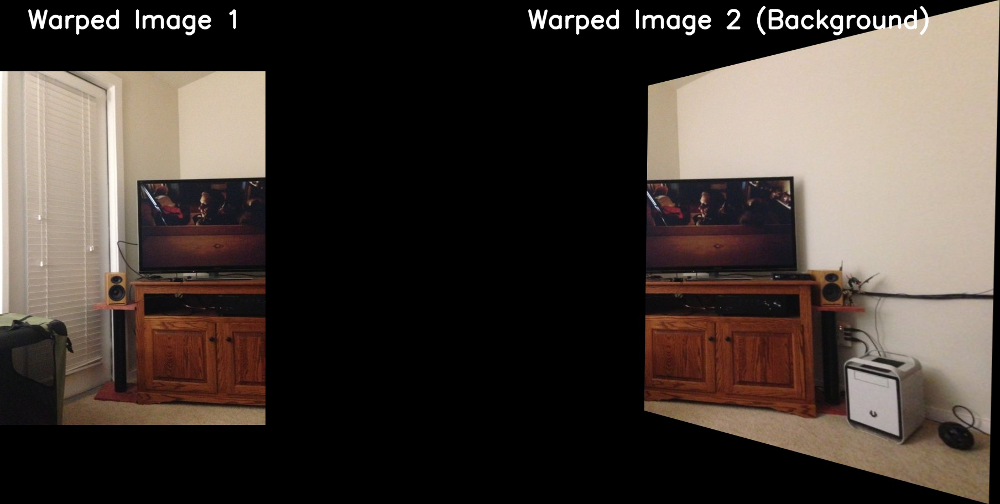
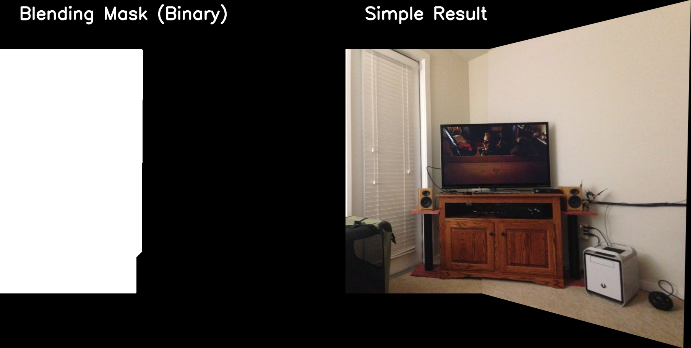
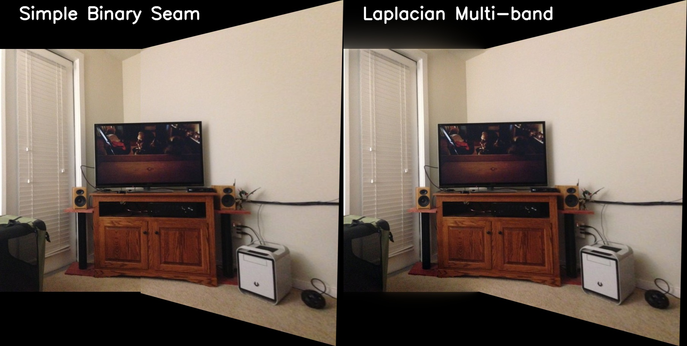
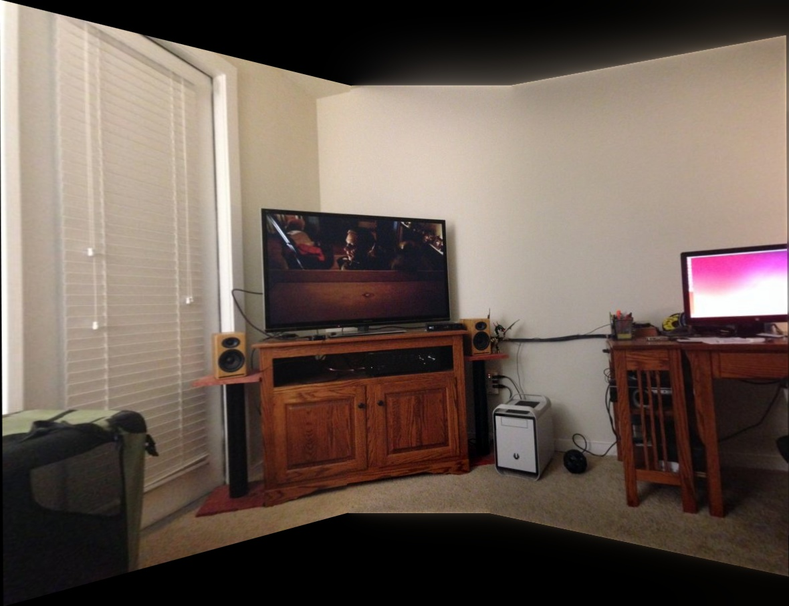
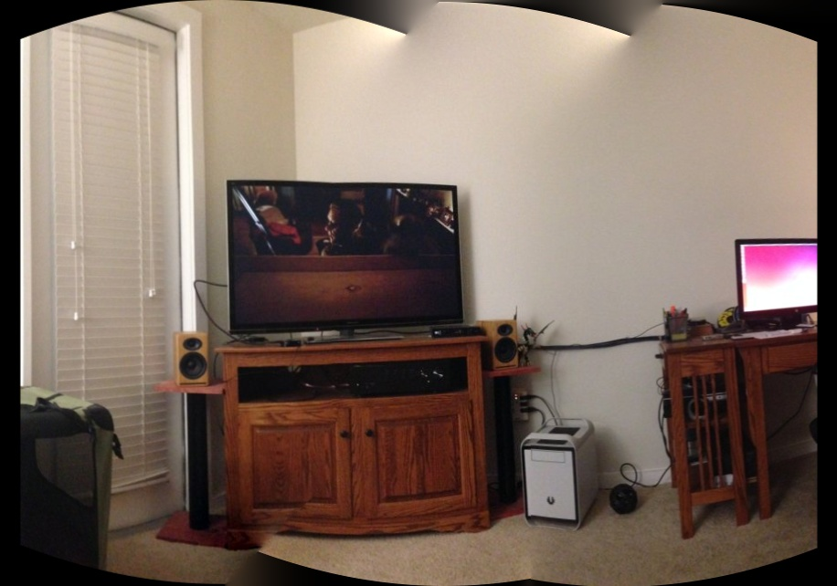

# Image Stitching: From Theory to Practice

This guide explains the core concepts behind our image stitching implementation. We focus on the "why" and "how" of registering, warping, and blending images. 
 **Note: This tutorial primarily discusses the simple case of stitching two images, but the concepts extend to multiple images (see Appendix C).** 

## 1. Registering Images

To stitch two images together, we first need to "register" them—that is, figure out how they align. 


<br>

1. **Feature Detection**: We use algorithms like SIFT (Scale-Invariant Feature Transform) to find distinctive keypoints (like corners or high-contrast spots) in both images.
2. **Feature Matching**: Each keypoint comes with a "descriptor" (a vector describing its local neighborhood). We match keypoints across images by finding descriptors with the smallest distance (e.g., using K-Nearest Neighbors and Lowe's ratio test).
   
```python
# Detect SIFT features
pts1, des1 = detector.detectAndCompute(image1, None)
pts2, des2 = detector.detectAndCompute(image2, None)

# Match using KNN
matches = bf_matcher.knnMatch(des2, des1, k=2)
# Apply Lowe's ratio test
good_matches = [m for m, n in matches if m.distance < n.distance * 0.7]
```


<br>

3. **Transformation Estimation**: Given these matching point pairs, we estimate a transformation matrix that maps points from Image 2's coordinate space to Image 1's coordinate space. 

## 2. Why Homography?

Generally, the transformation between two images of a 3D scene taken from different viewpoints is complex and depends heavily on the distance to the objects (depth) in the scene. This relationship is typically described using Epipolar Geometry (e.g., via the Fundamental Matrix). 

However, there are two specific cases where the transformation between pixel coordinates in two images can be perfectly described by a much simpler $3 \times 3$ matrix called a **Homography**:
1. **Planar Scene:** The cameras are viewing a completely flat, 2D plane (e.g., taking a picture of a painting, a document, or a completely flat wall).
2. **Pure Camera Rotation:** The cameras are located at the exact same point in 3D space, but are rotated and/or zoomed. There is no translation (movement) of the camera's optical center.

In image stitching, we are in the case of **pure camera rotation** because usually, multiple images taken for a panorama can be approximated as rotating the camera around its optical center without translation (like a photographer standing still and turning, or using a tripod). 

Because there is no translation, the 3D depth of the scene doesn't matter, and the mapping between the two images is a pure homography. *(See Appendix A for the mathematical proof).*

Using RANSAC (Random Sample Consensus) along with our matched features, we can robustly estimate this homography matrix $\mathbf{H}_{2 \to 1}$, which maps pixels from Image 2 to Image 1.

## 3. Warping the Images

Once we have our homography $\mathbf{H}_{2 \to 1}$, we must "warp" Image 2 so it aligns with Image 1. 

### Redefining the Canvas Boundary

To ensure both images fit into a single canvas without cropping:
1. We calculate the new coordinates of Image 2's corners using $\mathbf{H}_{2 \to 1}$.
2. We find the global minimum and maximum coordinates ($x_{\min}, y_{\min}$, etc.) across both the original Image 1 and the warped Image 2.
3. If the minimum $x$ or $y$ is negative, it means the warped image extends to the top or left of Image 1. We must introduce a **Translation Matrix (Offset)** to shift everything into positive coordinates:

$$
\mathbf{H}_{\text{offset}} = \begin{bmatrix} 1 & 0 & -x_{\min} \\ 0 & 1 & -y_{\min} \\ 0 & 0 & 1 \end{bmatrix}
$$

### Applying the Warps

To warp Image 1 onto the new canvas, we just apply the translation:
$$ \text{Image 1}_{\text{warped}} = \text{warpPerspective}(\text{Image 1}, \mathbf{H}_{\text{offset}}) $$

To warp Image 2, we combine the homography and the translation:
$$ \text{Image 2}_{\text{warped}} = \text{warpPerspective}(\text{Image 2}, \mathbf{H}_{\text{offset}} \mathbf{H}_{2 \to 1}) $$

```python
# Combine homography with canvas offset
H_final = H_offset @ H_2to1
# Warp images onto the shared canvas
warped1 = cv2.warpPerspective(image1, H_offset, (canvas_w, canvas_h))
warped2 = cv2.warpPerspective(image2, H_final, (canvas_w, canvas_h))
```


<br>

*(Under the hood, `warpPerspective` performs **inverse warping**: iterating over the new canvas coordinates, applying the inverse matrix to find the source coordinate, and using bilinear interpolation to sample the color).*

## 4. Simple Blending: Defining the Mask

Once warped, we have two aligned images. To combine them, we need to decide which image to use for each pixel on the canvas. We do this using a **Mask** ($M$).

### What is a Mask?
A mask is a grayscale image of the same size as our canvas where:
- A value of **1 (White)** means "Use Image 1".
- A value of **0 (Black)** means "Use Image 2".

The final image $I$ is calculated as:
$$ I = M \cdot I_1 + (1 - M) \cdot I_2 $$

```python
# Create a mask to define the seam
final_image = mask * warped1 + (1 - mask) * warped2
```

### Defining the Seam
For a beginner, the simplest mask is a **Binary Mask** that splits the overlap right down the middle. If Image 1 is on the left and Image 2 is on the right, we find the horizontal center of the overlapping region and create a mask that is 1 to the left of that line and 0 to the right.


<br>

While simple, this often leaves a visible "seam" because the two images might have slightly different brightness or colors. To solve this, we can use more advanced techniques like Laplacian Pyramids (see Appendix B).

---

## Appendix A: Proof that Pure Camera Rotation is a Homography

Let a 3D point be $\mathbf{P} = [X, Y, Z]^T$. 
A camera projects this 3D point onto a 2D pixel coordinate $\mathbf{p} = [x, y, 1]^T$ (in homogeneous coordinates) using the camera intrinsic matrix $\mathbf{K}$ and its rotation $\mathbf{R}$ and translation $\mathbf{t}$.

If the first camera is at the origin with no rotation, its projection equation is:
$$ \lambda_1 \mathbf{p}_1 = \mathbf{K}_1 [\mathbf{I} \mid \mathbf{0}] \begin{bmatrix} \mathbf{P} \\ 1 \end{bmatrix} = \mathbf{K}_1 \mathbf{P} $$
which gives $\mathbf{P} = \lambda_1 \mathbf{K}_1^{-1} \mathbf{p}_1$.

If the second camera shares the exact same center but is rotated by $\mathbf{R}$, its projection is:
$$ \lambda_2 \mathbf{p}_2 = \mathbf{K}_2 [\mathbf{R} \mid \mathbf{0}] \begin{bmatrix} \mathbf{P} \\ 1 \end{bmatrix} = \mathbf{K}_2 \mathbf{R} \mathbf{P} $$

Substituting $\mathbf{P}$ from the first equation into the second:
$$ \lambda_2 \mathbf{p}_2 = \mathbf{K}_2 \mathbf{R} (\lambda_1 \mathbf{K}_1^{-1} \mathbf{p}_1) $$
$$ \frac{\lambda_2}{\lambda_1} \mathbf{p}_2 = (\mathbf{K}_2 \mathbf{R} \mathbf{K}_1^{-1}) \mathbf{p}_1 $$

Since homogeneous coordinates are scale-invariant, the scalar $\frac{\lambda_2}{\lambda_1}$ doesn't change the 2D point. Therefore, the pixels are related by a $3 \times 3$ linear transformation matrix:
$$ \mathbf{H} = \mathbf{K}_2 \mathbf{R} \mathbf{K}_1^{-1} $$

This proves that for pure camera rotation, the mapping between the two images is purely a homography $\mathbf{H}$, entirely independent of the depth $Z$ of the 3D point $\mathbf{P}$!

## Appendix B: Advanced Blending (Laplacian Pyramids)

To eliminate visible seams, we use **Multi-band Blending**:
1. **Seam Finding (Distance Transform)**: To avoid artifacts from the sharp image boundaries, we compute a "distance transform" for both images. We place the blending seam exactly in the middle of the overlap—where both images have the most reliable data.
2. **Pyramid Decomposition**: We break both images and the weight mask into **Gaussian and Laplacian Pyramids**. 
3. **Multi-scale Blending**: We blend the Laplacian levels scale-by-scale. This allows us to blend low-frequency color changes over a wide area while keeping high-frequency details sharp and localized.
4. **Reconstruction**: Collapsing the blended levels creates a seamless, professional result.

```python
# Build pyramids
lp1 = build_laplacian_pyramid(image1)
lp2 = build_laplacian_pyramid(image2)
gm = build_gaussian_pyramid(weight_mask)

# Blend scale-by-scale
blended_lp = [m * l1 + (1 - m) * l2 for l1, l2, m in zip(lp1, lp2, gm)]
# Reconstruct
result = reconstruct_from_pyramid(blended_lp)
```

### Visual Comparison
As seen below, Laplacian blending (right) effectively hides the exposure differences and seam artifacts that are visible in simple binary blending (left).



## Appendix C: Multi-Image Stitching Strategies

When stitching more than two images, we have two primary implementation options in this repository:

### 1. Planar Multi-Image Stitching
This approach extends the 2-image homography logic. We select a central image as the **"Anchor"** reference and match all other images directly to it.

```python
# Select anchor index
ref_index = len(images) // 2
# Match every image to the same anchor
for i in range(len(images)):
    H = cv2.findHomography(pts_moving, pts_anchor, cv2.RANSAC)
```


<br>

**Limitations:**
- **Range Limitation:** This only works for short sequences (3-5 images). If the first and last images do not overlap with the central anchor, feature matching will fail.
- **Geometric Distortion:** For wide fields of view, the planar projection causes "infinite stretching" at the edges.
- **Alignment Strategy:** A more robust strategy for long sequences is **"Chaining"** (matching adjacent pairs $1 \to 2$, $2 \to 3$), but this is prone to "drift" (accumulated errors).

### 2. Cylindrical Multi-Image Stitching
This is the ideal model for panoramas taken with a rotating camera. We first project each planar image onto a cylinder before aligning them.

**The Math:** We project planar coordinates $(x, y)$ onto a cylinder with radius $f$:
- $\theta = \arctan((x - w/2) / f)$
- $x_{\text{cyl}} = f \cdot \theta + w/2$
- $y_{\text{cyl}} = (y - h/2) \cdot \cos(\theta) + h/2$

Once all images are projected onto the cylinder, aligning them becomes a simple matter of finding the **pure 2D translation** $(dx, dy)$ between the overlapping regions:

```python
# do SIFT detections and get matched points
# ...

# Project planar image to cylindrical surface
cylindrical_img = cv2.remap(planar_img, x_src, y_src, cv2.INTER_LINEAR)

# transform points coords to cylindrical space
# ...

# Align in cylindrical space (Pure 2D translation)
shift = np.median(pts_ref - pts_moving, axis=0)
H = np.array([[1, 0, shift[0]], [0, 1, shift[1]], [0, 0, 1]])
```


<br>

**Benefits & Limitations:**
- **Benefit:** Once on the cylinder, the relationship between images becomes a **pure 2D translation** $(dx, dy)$, which is much simpler to estimate and prevents edge stretching.
- **Limitation (Wavy Boundaries):** The top and bottom edges of the panorama appear wavy because straight lines in the original images become curves on the cylinder. Standard software uses **Auto-Cropping** to fix this.
- **Limitation (Focal Length):** This method requires an accurate estimate of the camera's focal length ($f$) to project the curves correctly.
